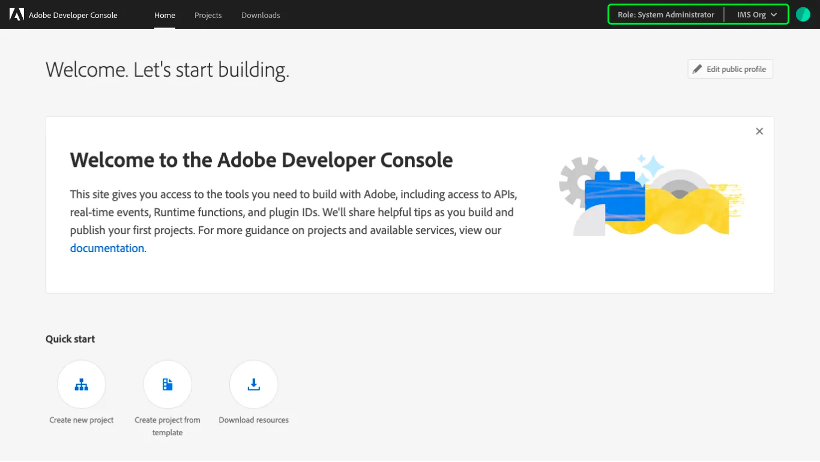
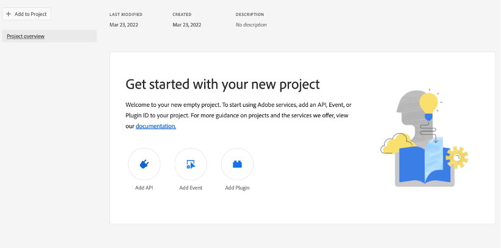
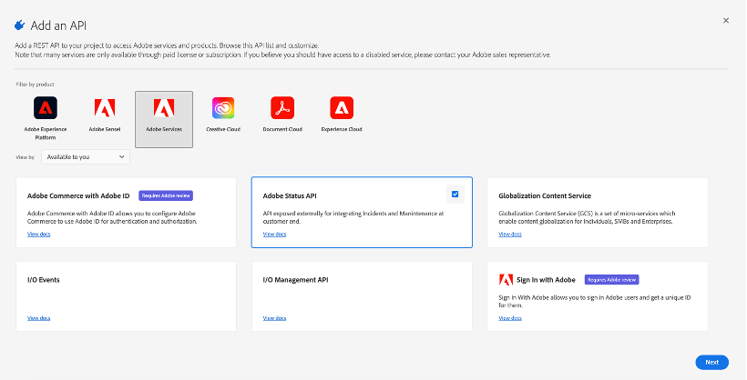
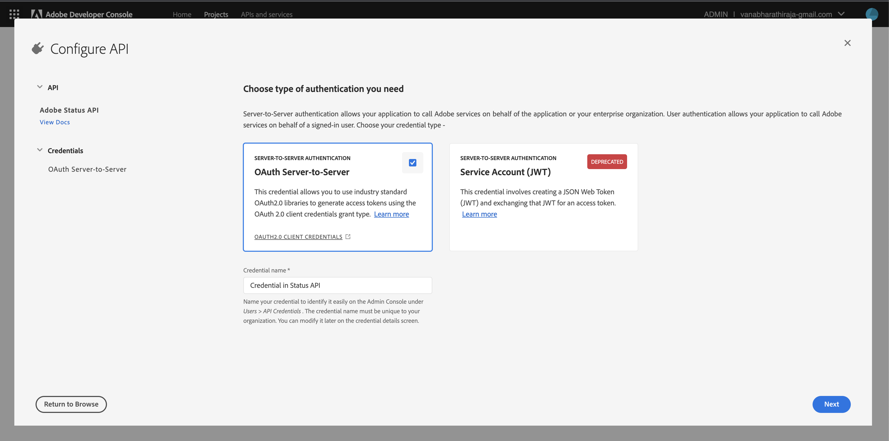
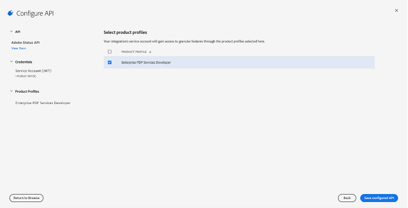
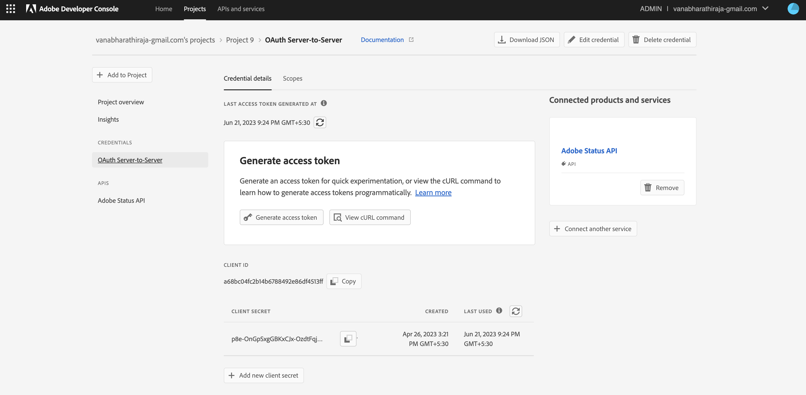

# Getting started with the Adobe Status API

There are several steps to take before using the Status APIs.

* Permissions: Configure permissions for the developer in the Adobe Admin Console.  
* API Client: Create a client configuration in the Adobe Developer Console.  
* Authentication: Obtain the necessary credentials to send data to Adobe.  

Once the setup is complete you can refer to Product hierarchy and Sample API calls from the left menu.

## Permissions

Before starting to use the Status API, you must make sure that your account has the correct permissions to send requests. Even if you successfully authenticate with an Adobe ID, you cannot make requests to Adobe unless your account contains the correct organization permissions.

Your organization needs to have entitlements for at least one Adobe product to be able to access Adobe APIs. At this time, only Enterprise accounts have access to Status APIs. Team accounts do not have permission to access the APIs.

If your organization has Enterprise licenses, please follow these steps to assign product profile admin permissions to the developer who will access Status APIs:

1. Navigate to adminconsole.adobe.com.
2. Check the organization name in the top right to make sure that you are logged in to the correct company.
3. Click Products, then click on any Adobe product that you want to assign permissions to.
4. Select the desired product profile, or create a new product profile.
5. Under the Permissions tab, assign the desired permissions to the product profile.
6. Once the desired permissions are set, click the Developers tab.
7. Click Add Developer, and enter the user name or email address that you want to assign the permissions to.
8. Click Save.
See Managing Developers in the Enterprise Admin user guide for more information.

## API Client

Once you are a developer for an Adobe product profile, you can create a Status API client in the Adobe Developer Console.

1. Log in to [Adobe Developer Console](https://developer.adobe.com/console/home)
2. Create a new project
3. Add Adobe Status API to the project. Adobe Status API card will show up if there is at least one entitlement for Adobe products/services in your organization and administrative permission for your org to create integrations.  

To learn more about creating projects in Adobe Developer Console, read the [Console getting started guide](https://developer.adobe.com/developer-console/docs/guides/getting-started/).
At this point, you decide how you want to authenticate with the API.

## Setting up the OAuth Server-to-Server credential

Status API needs an OAuth token for authentication. Follow the below steps to generate an OAuth Server-to-Server credential.

### Credential Name

An admin in your organization can manage all OAuth Server-to-Server credentials by visiting the [Adobe Admin Console](https://adminconsole.adobe.com) > Users > API credentials. To find the correct API credential easily on the Admin Console, you can provide your OAuth Server-to-Server credential a name during credential setup.

1. Choose the type of authentication as OAuth Server-to-Server and set the credential name

#### Note: This name can be modified later in your project by visiting the OAuth Server-to-Server credential overview page.

2. Select the product profile and save the configured Status API
3. Generating access tokens for experimentation with the OAuth Server-to-Server credential is straightforward. You can use the 'Generate access token' button on the credential overview page or copy the cURL command and use the command line to generate an access token for quick use.

|Parameter|Mandatory|Description|
|---|---|---|
|`grant_type`|Yes|Value should always be `client_credentials`|
|`client_id`|Yes|The Client ID obtained from the [Adobe Developer Console](/console)|
|`client_secret`|Yes|The value of client secret obtained from the [Adobe Developer Console](/console)|
|`scopes`|Yes|The list of comma-separated scopes you are requesting. To see the scopes available to your credential, visit your project your the [Adobe Developer Console](/console)|

```curl
curl -X POST 'https://ims-na1.adobelogin.com/ims/token/v3?client_id={CLIENT_ID}' \
  -H 'Content-Type: application/x-www-form-urlencoded' \
  -d 'client_secret={CLIENT_SECRET}&grant_type=client_credentials&scope={SCOPES}'
```

### Sample Response

```json
{
    "access_token": "{ACCESS_TOKEN}",
    "token_type": "bearer",
    "expires_in": 86399
}
```

## Refreshing access tokens

The access token becomes invalid after its expiry time, `expires_in` represents the expiry time which is usually 24 hours from the token generation. You do not need a refresh token for OAuth Server-to-Server credentials. You can always request a new access token directly using your *client_id*, *client_secret*, and *scopes*.



### Generating access tokens using standard OAuth2 libraries

We recommend using a standard OAuth 2.0 library to implement your application's access token generation logic. The  OAuth community site https://oauth.net has a huge list of community-maintained OAuth2 libraries. Some widely known and maintained OAuth2 libraries from that list are -

1. [PassportJS](https://github.com/jaredhanson/passport) (Node.js)
2. [Spring Security](https://spring.io/projects/spring-security) (Java)
3. [Authlib](https://github.com/lepture/authlib) (Python)
4. View more libraries at https://oauth.net/code/

<InlineAlert slots="text"/>

Using industry-standard libraries is the quickest and most secure way of integrating with OAuth. We recommend developers diligently pick the OAuth 2.0 library that works best for their application.

## Rotating client secrets 

The OAuth Server-to-Server credentials allow you to rotate your client secret as needed.

Rotating your application's client secrets is highly recommended in case of a leak or unauthorized access. Furthermore, rotating client secrets periodically is an industry-standard practice that strengthens your application security posture. Follow [Rotating client secrets](https://developer.adobe.com/developer-console/docs/guides/authentication/ServerToServerAuthentication/implementation/#rotating-client-secrets) guide for more information.

## Migration Guide

Log in to the Adobe Developer Console and open the [Projects Tab](https://developer.adobe.com/console/projects) to find out which of your Adobe applications and integrations are using the Service Account (JWT) credential. If any of your project's integration is using the JWT credential, then follow the [Migration Guide](https://developer.adobe.com/developer-console/docs/guides/authentication/ServerToServerAuthentication/migration/#migration-overview) to update your integration to OAuth Server-to-Server credentials.
