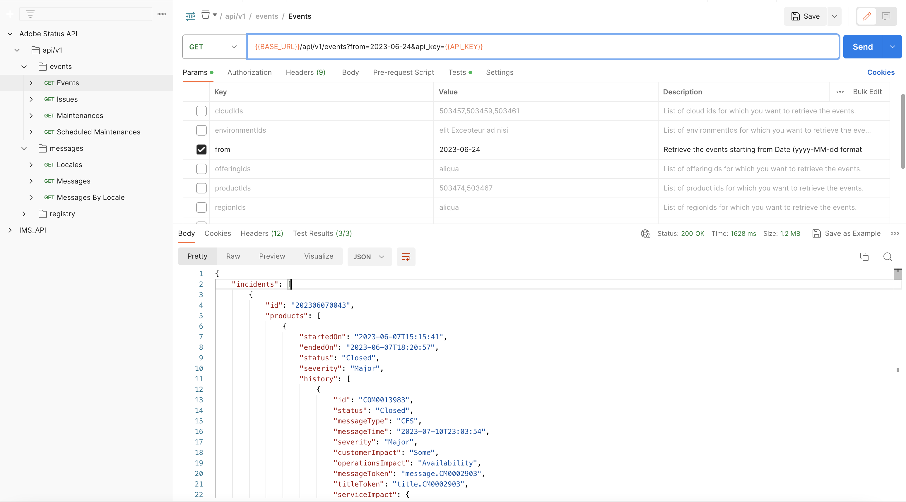

# Postman Collection

- Download Status API postman collection and environment variable from here - [Postman Collection](../../../../static/postman-collection-and-env.zip)
- Import both collection and environment variables into your postman 
- Replace below credentials with yours and run collection endpoints 
    - CLIENT_ID, TECHNICAL_ACCOUNT_ID , TECHNICAL_ACCOUNT_ID and CLIENT_SECRET
    - PRIVATE_KEY – Replace private key which is obtained during the Adobe Status API onboarding in the developer console

 ## Environment Variable Reference

## Status API Postman Collection Reference

